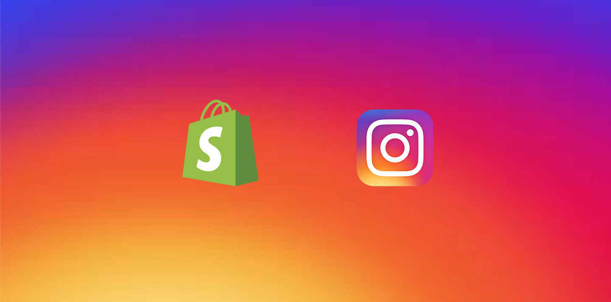

### WHY IS INSTAGRAM IMPORTANT FOR ONLINE SALES?

Instagram has grown to become one of the most powerful social platforms for facilitating online sales. The social media platform was quick to recognise this shift in demand and have over time incorporated a range of new shoppable features into the app, with a view to encourage its users to discover brands and boost eCommerce sales.

Having your Instagram linked to your Shopify store is a great way to build trust between you and your customers. According to PixelRocket, 62% of Instagram users are more likely to be interested in a product if they’ve seen it previously on Instagram. Not only is this an effective way to increase conversion, but it also adds high quality content to your shop.

### HOW DO I INTEGRATE INSTAGRAM WITH MY SHOPIFY STORE?

As of 29th June 2020, Instagram discontinued it’s API, meaning that Shopify store merchants can no longer directly integrate their real time Instagram feed with their store. But don’t panic, it is still possible to display your latest Instagram posts on your storefront.

There are a number of third party platforms available on the Shopify app store that will allow you to keep your consumers updated with your latest Instagram posts and maintain synergy across both platforms.

It's very easy to make some words **bold** and other words *italic* with Markdown. You can even [link to Google!](http://google.com)